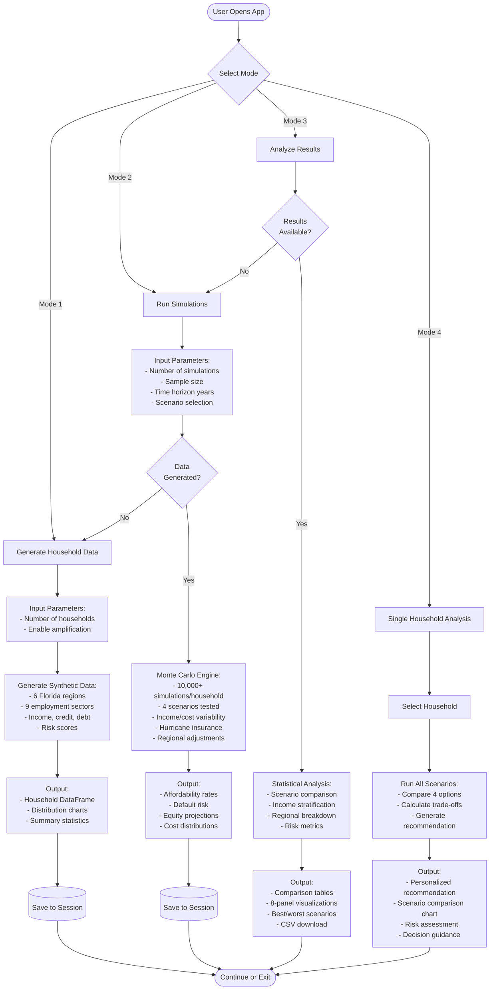

# Florida Housing Affordability Analyzer - Process Flow

## System Architecture



## Data Flow Detail

### 1️⃣ Generate Household Data
**Inputs:**
- Number of households (50-5000)
- Amplification flag (True/False)

**Processing:**
- Sample Florida regions (weighted by population)
- Assign employment sectors (Tourism, Healthcare, Tech, etc.)
- Generate income from sector ranges
- Calculate credit scores (normal distribution)
- Compute monthly debt and savings
- Calculate financial risk score (0-100)
- Optional: Add 30% edge cases

**Outputs:**
- DataFrame with household profiles
- Income distribution histogram
- Regional/sector breakdown charts

---

### 2️⃣ Run Monte Carlo Simulations
**Inputs:**
- Generated household data
- Number of simulations (1,000-20,000)
- Sample size (households to simulate)
- Time horizon (5-30 years)
- Scenarios: Rent, Starter, Standard, Premium

**Processing (per household, per scenario):**
```
FOR each simulation (1 to N):
  1. Sample home price (if buying)
  2. Sample interest rate (Normal distribution)
  3. Calculate monthly costs:
     - Mortgage payment
     - Property tax (0.9%)
     - Hurricane insurance (region-adjusted)
     - HOA fees
     - Maintenance
  4. Simulate each year:
     - Income changes (±20%)
     - Rent/insurance increases (3-20%)
     - Property appreciation (±6%)
     - Unexpected expenses
  5. Check affordability each month:
     - If (housing + debt) < 50% income: affordable
     - Else: default risk
  6. Track equity (if buying)
  7. Sum total costs
END FOR

Calculate statistics across all simulations
```

**Outputs:**
- Affordability probability (% of simulations affordable)
- Default risk (% of simulations defaulted)
- Mean/median/percentile costs
- Mean/median/percentile equity
- Results DataFrame

---

### 3️⃣ Analyze Results
**Inputs:**
- Simulation results from all households
- Household characteristics

**Processing:**
- Overall statistics (success rates, costs, equity)
- Group by scenario (Rent vs Buy comparisons)
- Stratify by income brackets ($<40k, $40-60k, etc.)
- Stratify by region (Miami, Tampa, Orlando, etc.)
- Generate 8-panel visualization:
  1. Affordability by scenario
  2. Cost distributions
  3. Equity distributions
  4. Income stratification
  5. Regional analysis
  6. Risk vs reward scatter
  7. Best scenario heatmap
  8. Summary metrics

**Outputs:**
- Summary tables
- Comparative charts
- Statistical metrics
- CSV export option

---

### 4️⃣ Single Household Analysis
**Inputs:**
- Selected household ID
- All simulation results for that household

**Processing:**
- Compare all 4 scenarios side-by-side
- Calculate trade-offs:
  - Affordability vs Equity
  - Cost vs Risk
  - Short-term vs Long-term
- Apply decision logic:
  ```
  IF affordability > 80% AND equity > $75k:
      Recommend: Buy Standard Home
  ELIF affordability > 70% AND risk_score < 30:
      Recommend: Buy Starter Home
  ELIF income < $50k OR risk_score > 50:
      Recommend: Keep Renting
  ELSE:
      Recommend: Custom analysis
  ```

**Outputs:**
- Recommended scenario with rationale
- Comparison chart (all scenarios)
- Expected outcomes (affordability, cost, equity)
- Risk level indicator (Low/Medium/High)

---

## Key Features

✅ **Florida-Specific Factors:**
- Hurricane insurance ($3,500-$8,500/year)
- Regional price multipliers (Miami 1.35x, Panhandle 0.85x)
- Property tax (0.9% Florida average)
- Employment sector income ranges

✅ **Monte Carlo Variables:**
- Income changes: Normal(3%, 8%)
- Interest rates: Normal(6.5%, 1.2%)
- Property appreciation: Normal(4%, 6%)
- Insurance increases: Triangular(10%, 15%, 20%)
- Rent increases: Triangular(3%, 5.5%, 10%)

✅ **Output Metrics:**
- Affordability Rate: % of scenarios maintaining payments
- Default Risk: % of scenarios ending in failure
- Equity Built: Home value - remaining principal - down payment
- Total Cost: Sum of all housing expenses over time horizon
- Value at Risk (VaR): 95th percentile cost

---

## Technical Stack

**Language:** Python 3.10
**Core Libraries:** NumPy, Pandas, SciPy
**Visualization:** Matplotlib, Seaborn, Streamlit
**Deployment:** Streamlit Cloud
**Data:** Synthetic (Florida-calibrated parameters)

---

**Author:** Horacio Fonseca
**Repository:** https://github.com/horacefonseca/FL_housing_montecarlo_estimation_app
